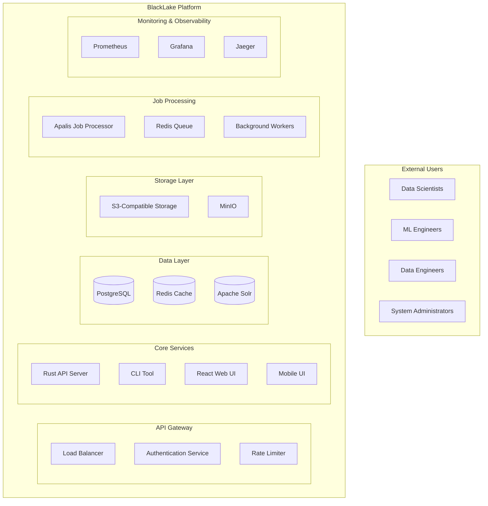
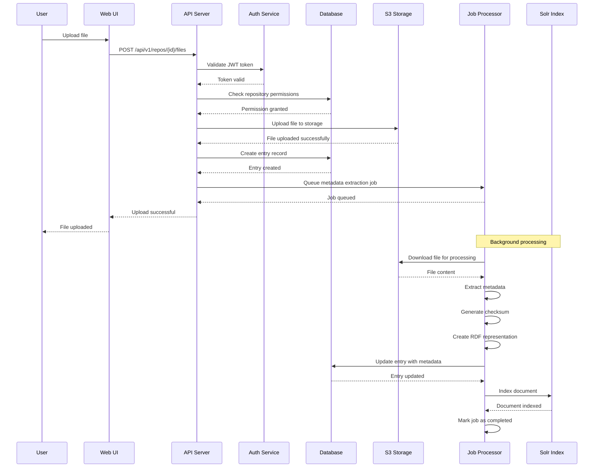
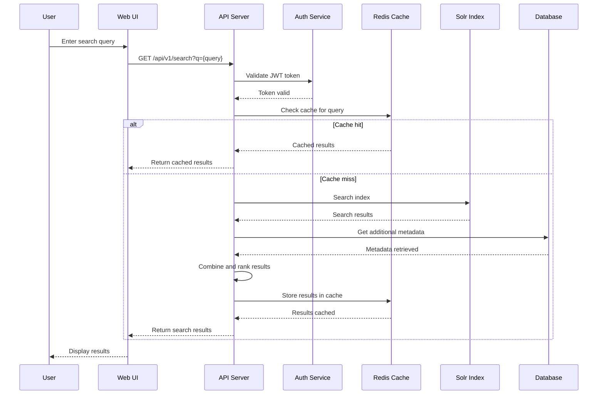

# BlackLake Architecture

This document provides a comprehensive overview of the BlackLake architecture, including system components, data flow, and design principles.

## System Overview

BlackLake is built as a modern, cloud-native data platform with the following key characteristics:

- **Microservices Architecture**: Loosely coupled services with clear boundaries
- **API-First Design**: RESTful APIs with OpenAPI specifications
- **Event-Driven**: Asynchronous processing with event sourcing
- **Multi-tenant**: Secure isolation between organizations
- **Scalable**: Horizontal scaling capabilities
- **Observable**: Comprehensive monitoring and logging

## High-Level Architecture

## Core Components

### API Server (Rust)

The API server is the heart of BlackLake, built with Rust for performance and safety:

- **Framework**: Axum for HTTP handling
- **Authentication**: JWT/OIDC integration
- **Database**: PostgreSQL with connection pooling
- **Caching**: Redis for session and query caching
- **Search**: Apache Solr integration
- **Storage**: S3-compatible object storage

**Key Features**:
- RESTful API with OpenAPI documentation
- Rate limiting and DDoS protection
- Request/response logging and metrics
- Health checks and monitoring
- Multi-tenant data isolation

### Database Layer

#### PostgreSQL (Primary Database)
- **Purpose**: Primary data store for metadata, users, permissions
- **Features**: JSONB support for flexible metadata, full-text search
- **Scaling**: Read replicas for query distribution
- **Backup**: Automated backups with point-in-time recovery

#### Redis (Cache & Sessions)
- **Purpose**: Session storage, query caching, job queues
- **Features**: Pub/sub for real-time updates, TTL for cache expiration
- **Scaling**: Cluster mode for high availability
- **Persistence**: RDB snapshots and AOF for durability

#### Apache Solr (Search Engine)
- **Purpose**: Full-text search, faceted search, suggestions
- **Features**: Distributed search, real-time indexing, spell checking
- **Scaling**: SolrCloud for horizontal scaling
- **Schema**: Managed schema with dynamic fields

### Storage Layer

#### S3-Compatible Storage
- **Purpose**: Object storage for files and artifacts
- **Features**: Versioning, lifecycle policies, server-side encryption
- **Scaling**: Multi-region replication
- **Access**: Signed URLs for secure access

#### MinIO (Development)
- **Purpose**: S3-compatible storage for development
- **Features**: Local development, testing, CI/CD
- **Configuration**: Single-node or distributed mode

### Job Processing

#### Apalis Framework
- **Purpose**: Background job processing
- **Features**: Job queues, retry logic, dead letter queues
- **Scaling**: Multiple workers with load balancing
- **Monitoring**: Job metrics and failure tracking

#### Job Types
- **Metadata Extraction**: Analyze files and extract metadata
- **RDF Generation**: Create semantic representations
- **Export Jobs**: Generate exports and reports
- **Cleanup Jobs**: Retention policy enforcement
- **Webhook Delivery**: Send notifications to external systems

## Data Flow

### File Upload Flow

### Search Flow

## Security Architecture

### Authentication & Authorization

#### OIDC/JWT Integration
- **Provider**: External OIDC provider (Auth0, Okta, etc.)
- **Tokens**: JWT tokens with role-based claims
- **Refresh**: Automatic token refresh
- **Validation**: Token signature and expiration validation

#### Multi-tenant Isolation
- **Data Isolation**: Repository-level access control
- **Network Isolation**: VPC and security groups
- **Resource Quotas**: Per-tenant resource limits
- **Audit Logging**: Complete audit trail

#### API Security
- **Rate Limiting**: Per-user and per-IP limits
- **CORS**: Configurable cross-origin policies
- **CSRF Protection**: Double-submit token pattern
- **Input Validation**: Comprehensive input sanitization

### Data Protection

#### Encryption
- **At Rest**: AES-256 encryption for stored data
- **In Transit**: TLS 1.3 for all communications
- **Key Management**: AWS KMS or HashiCorp Vault
- **Database**: Transparent data encryption (TDE)

#### Access Controls
- **RBAC**: Role-based access control
- **ABAC**: Attribute-based access control
- **Fine-grained**: Repository and file-level permissions
- **Temporary**: Time-limited access tokens

## Scalability & Performance

### Horizontal Scaling

#### API Servers
- **Load Balancing**: NGINX or cloud load balancer
- **Stateless**: No server-side session state
- **Auto-scaling**: Based on CPU and memory metrics
- **Health Checks**: Automated health monitoring

#### Database Scaling
- **Read Replicas**: Distribute read queries
- **Connection Pooling**: Efficient connection management
- **Query Optimization**: Indexing and query analysis
- **Partitioning**: Table partitioning for large datasets

#### Storage Scaling
- **S3**: Virtually unlimited storage
- **CDN**: CloudFront for global distribution
- **Caching**: Multi-level caching strategy
- **Compression**: Automatic compression for large files

### Performance Optimization

#### Caching Strategy
- **Application Cache**: In-memory caching for frequently accessed data
- **Database Cache**: Query result caching
- **CDN Cache**: Static asset caching
- **Search Cache**: Search result caching

#### Query Optimization
- **Indexing**: Strategic database indexing
- **Query Analysis**: Slow query identification
- **Connection Pooling**: Efficient connection reuse
- **Batch Operations**: Bulk operations for efficiency

## Monitoring & Observability

### Metrics Collection

#### Application Metrics
- **Request Rate**: API requests per second
- **Response Time**: P50, P95, P99 latencies
- **Error Rate**: 4xx and 5xx error rates
- **Business Metrics**: User activity, data volume

#### Infrastructure Metrics
- **CPU Usage**: Server CPU utilization
- **Memory Usage**: RAM and swap usage
- **Disk I/O**: Storage performance
- **Network I/O**: Network throughput

#### Database Metrics
- **Connection Pool**: Active and idle connections
- **Query Performance**: Slow query identification
- **Lock Contention**: Database lock analysis
- **Replication Lag**: Read replica lag monitoring

### Logging

#### Structured Logging
- **Format**: JSON structured logs
- **Levels**: DEBUG, INFO, WARN, ERROR
- **Context**: Request ID, user ID, correlation ID
- **Sampling**: Configurable log sampling

#### Log Aggregation
- **Collection**: Fluentd or Fluent Bit
- **Storage**: Elasticsearch or cloud logging
- **Search**: Kibana or cloud search
- **Retention**: Configurable log retention

### Tracing

#### Distributed Tracing
- **Framework**: OpenTelemetry or Jaeger
- **Instrumentation**: Automatic and manual instrumentation
- **Context Propagation**: Request context across services
- **Performance Analysis**: End-to-end request tracing

## Deployment Architecture

### Container Orchestration

#### Kubernetes
- **Pods**: Container orchestration
- **Services**: Service discovery and load balancing
- **Ingress**: External traffic routing
- **ConfigMaps**: Configuration management
- **Secrets**: Secret management

#### Helm Charts
- **Templates**: Kubernetes resource templates
- **Values**: Environment-specific configuration
- **Dependencies**: Chart dependencies
- **Upgrades**: Rolling updates and rollbacks

### CI/CD Pipeline

#### GitHub Actions
- **Build**: Docker image building
- **Test**: Automated testing
- **Security**: Vulnerability scanning
- **Deploy**: Automated deployment

#### Deployment Strategies
- **Blue-Green**: Zero-downtime deployments
- **Rolling**: Gradual rollout
- **Canary**: Traffic splitting for testing
- **Rollback**: Quick rollback capabilities

## Disaster Recovery

### Backup Strategy

#### Database Backups
- **Frequency**: Daily full backups
- **Incremental**: Hourly incremental backups
- **Retention**: 30-day retention policy
- **Testing**: Regular restore testing

#### Storage Backups
- **Replication**: Cross-region replication
- **Versioning**: Object versioning
- **Lifecycle**: Automated lifecycle policies
- **Encryption**: Backup encryption

### High Availability

#### Multi-AZ Deployment
- **Availability Zones**: Multi-AZ deployment
- **Load Balancing**: Cross-AZ load balancing
- **Failover**: Automatic failover
- **Monitoring**: Health check monitoring

#### Active-Standby
- **Primary**: Active database
- **Standby**: Read-only replica
- **Promotion**: Manual promotion procedures
- **Monitoring**: Replication lag monitoring

## Development Workflow

### Local Development

#### Docker Compose
- **Services**: All services in one stack
- **Networking**: Service discovery
- **Volumes**: Persistent data storage
- **Environment**: Development configuration

#### Hot Reloading
- **API Server**: Cargo watch for Rust
- **Web UI**: Vite hot module replacement
- **Database**: Schema migrations
- **Testing**: Automated testing

### Testing Strategy

#### Unit Tests
- **Coverage**: 80%+ code coverage
- **Isolation**: Mock external dependencies
- **Performance**: Benchmark testing
- **Security**: Security testing

#### Integration Tests
- **API Testing**: End-to-end API testing
- **Database Testing**: Database integration testing
- **Storage Testing**: S3 integration testing
- **Search Testing**: Solr integration testing

#### Load Testing
- **k6 Scripts**: Performance testing
- **Metrics**: Performance metrics collection
- **Thresholds**: Performance thresholds
- **Reporting**: Performance reports

This architecture provides a solid foundation for a scalable, secure, and maintainable data platform. The modular design allows for independent scaling of components and easy addition of new features.
