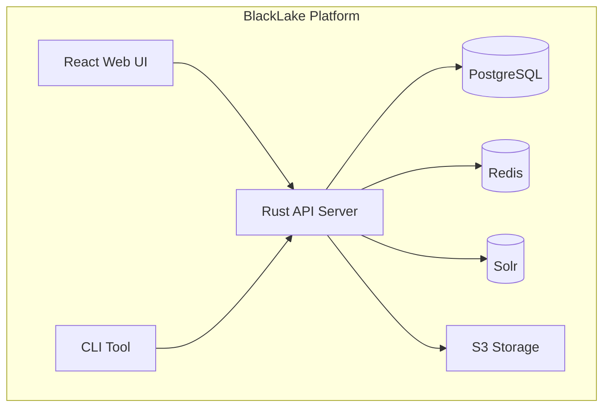

# BlackLake Documentation

Welcome to the BlackLake documentation. BlackLake is a **production-ready, enterprise-grade data artifact management platform** that combines modern technology with comprehensive features for data management, search, governance, and compliance.

## 🚀 Quick Start

### One-Command Setup
```bash
# Build everything and start the full stack
just setup-all
```

### Alternative Setup Methods
```bash
# Using the quick setup script
./quick-setup.sh

# Using optimized build script
./build-optimized.sh dev

# Using Docker directly
docker buildx bake local
docker compose --profile dev up -d --wait
```

## 📋 Project Status

**BlackLake is PRODUCTION-READY** with comprehensive implementation of Weeks 1-8:

### ✅ Completed Features
- **Week 1**: Core Infrastructure (Rust API, PostgreSQL, S3 storage)
- **Week 2**: Search & Metadata (JSONB search, Dublin Core, RDF)
- **Week 3**: Security & Multi-Tenancy (OIDC auth, RBAC, rate limiting)
- **Week 4**: Governance & Safety Rails (branch protection, quotas, webhooks)
- **Week 5**: Operational Hardening (multi-arch builds, monitoring, K6 testing)
- **Week 6**: Advanced Search & Sessions (Solr integration, server sessions)
- **Week 7**: Enterprise Hardening (ABAC policies, data classification, SDKs)
- **Week 8**: Federation & AI Features (connectors, semantic search, mobile UX)

### 🔄 Carryover Items (Week 9)
- Reliability & Disaster Recovery
- Cost & Lifecycle Governance
- Access Reviews & Data Egress Controls
- Performance Baseline & Load Testing
- Documentation System (MkDocs + Material) ← **This is it!**

## 🏗️ Architecture Overview

### System Architecture


### Technology Stack
- **Backend**: Rust with Axum framework
- **Frontend**: React with TypeScript and Tailwind CSS
- **Database**: PostgreSQL with JSONB search
- **Search**: Apache Solr with advanced features
- **Cache**: Redis for sessions and job queues
- **Storage**: S3-compatible storage with MinIO
- **Monitoring**: Prometheus, Grafana, OpenTelemetry
- **Containerization**: Docker with multi-arch builds

### Key Features
- **Multi-Tenant Architecture**: ABAC policies with tenant isolation
- **Advanced Security**: OIDC/JWT authentication, RBAC, audit trails
- **Comprehensive Governance**: Branch protection, quotas, retention policies
- **Production Operations**: Monitoring, backup, disaster recovery
- **Modern UI**: React interface with mobile support and PWA capabilities
- **Developer Experience**: CLI tools, SDKs, comprehensive documentation

## 🔧 Development Workflow

### Daily Development
```bash
# Quick start
just up-dev && just logs api

# With specific features
just up-profiles "dev,search-os" && just logs solr
```

### Building & Testing
```bash
# Build all images
just bake

# Run tests
just test

# Lint and format
just lint
just fmt
```

### Production Deployment
```bash
# Build production images
docker buildx bake prod

# Deploy
just up-prod
```

## 📊 Monitoring & Observability

### Access Points
- **API**: http://localhost:8080
- **UI**: http://localhost:8080 (served by gateway)
- **Grafana**: http://localhost:3000 (admin/admin)
- **Solr**: http://localhost:8983
- **MinIO**: http://localhost:9001 (minioadmin/minioadmin)
- **Keycloak**: http://localhost:8081 (admin/admin)

### Monitoring Stack
- **Prometheus**: Metrics collection and storage
- **Grafana**: Dashboards and visualization
- **OpenTelemetry**: Distributed tracing
- **Jaeger**: Trace analysis and debugging

## 🔒 Security Features

### Authentication & Authorization
- **OIDC/JWT**: Keycloak integration with JWKS rotation
- **RBAC**: Role-based access control
- **ABAC**: Attribute-based access control with policies
- **Multi-Tenancy**: Tenant isolation and data segregation

### Security Controls
- **Input Validation**: Comprehensive validation and sanitization
- **Rate Limiting**: Per-user and per-IP rate limiting
- **Security Headers**: CORS, CSRF protection, security headers
- **Audit Logging**: Complete audit trail for compliance

## 📦 SDKs & Integrations

### Official SDKs
- **Python SDK**: Full-featured Python client with async support
- **TypeScript SDK**: TypeScript client with type safety
- **CLI Tools**: Command-line interface for operations

### Federation Connectors
- **S3 Connector**: S3-compatible storage integration
- **Postgres Connector**: PostgreSQL database integration
- **CKAN Connector**: CKAN data portal integration

## 🚀 Production Readiness

### Infrastructure
- **Container Orchestration**: Docker Compose with profiles
- **Multi-Architecture**: AMD64/ARM64 builds
- **Service Discovery**: Internal networking
- **Load Balancing**: Gateway with Envoy/Nginx
- **Health Monitoring**: Comprehensive health checks

### Operations
- **Monitoring**: Prometheus metrics + Grafana dashboards
- **Logging**: Structured logging with OpenTelemetry
- **Backup**: Automated backup procedures
- **Disaster Recovery**: DR runbooks and procedures
- **Performance**: K6 load testing and monitoring

### Scalability
- **Horizontal Scaling**: Stateless API design
- **Database**: Connection pooling and optimization
- **Caching**: Redis for sessions and job queues
- **Search**: Solr for advanced search capabilities
- **Storage**: S3-compatible with lifecycle policies

## 📚 Documentation Structure

This documentation is organized into the following sections:

- **[Project Status](PROJECT_STATUS.md)** - Current project status and completion summary
- **[Verification](VERIFICATION.md)** - Comprehensive verification of all systems
- **[Fast Setup](FAST_SETUP.md)** - Quick setup guide with build optimization
- **[Implementation Summary](IMPLEMENTATION_SUMMARY.md)** - Week-by-week implementation details
- **[Deployment](DEPLOYMENT.md)** - Production deployment guide
- **[Operations](OPERATIONS.md)** - Operations runbooks and procedures
- **[Search](SEARCH.md)** - Search functionality documentation
- **[Sessions](SESSIONS.md)** - Session management documentation
- **[Images](IMAGES.md)** - Docker image documentation

## 🎯 Getting Help

### Documentation Issues
If you find issues with the documentation, please:
1. Check the [**Project Status**](PROJECT_STATUS.md) for current status
2. Review the [**Verification**](VERIFICATION.md) for system status
3. Consult the [**Fast Setup**](FAST_SETUP.md) for setup issues

### Technical Issues
For technical issues:
1. Check the [**Operations**](OPERATIONS.md) runbooks
2. Review the [**Deployment**](DEPLOYMENT.md) guide
3. Consult the [**Implementation Summary**](IMPLEMENTATION_SUMMARY.md) for details

### Feature Requests
For feature requests and future development:
1. Check the [**TODO.md**](../TODO.md) for carryover items
2. Review the [**Project Status**](PROJECT_STATUS.md) for roadmap
3. Consult the [**Implementation Summary**](IMPLEMENTATION_SUMMARY.md) for current features

---

## 🎉 Welcome to BlackLake!

BlackLake is a **production-ready, enterprise-grade data artifact management platform** that combines modern technology with comprehensive features for data management, search, governance, and compliance.

**Ready to get started?** Check out the [**Fast Setup**](FAST_SETUP.md) guide and begin your journey with BlackLake!
